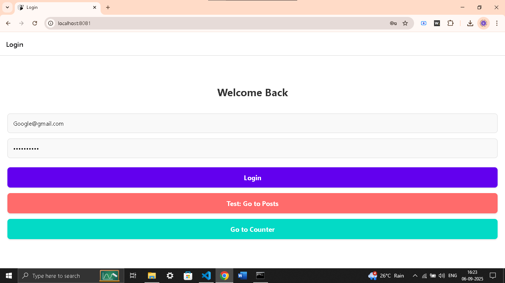
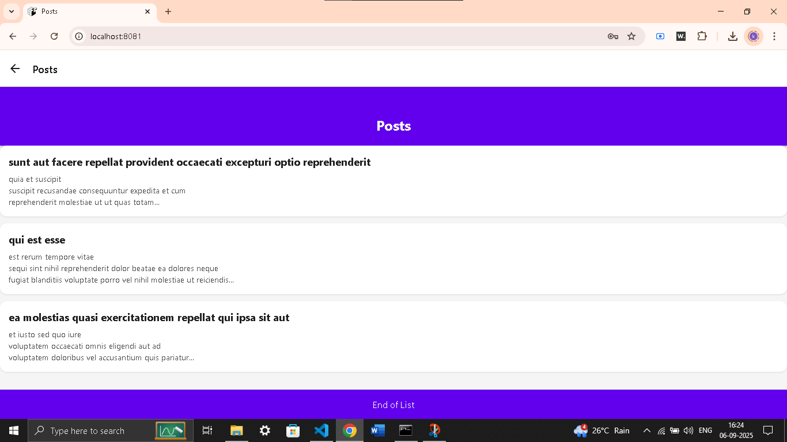
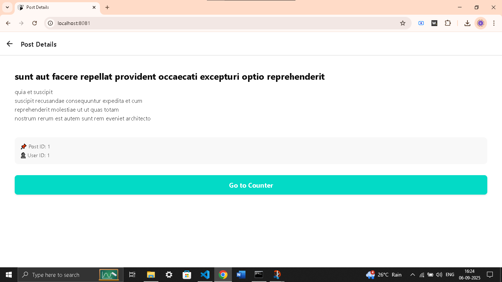
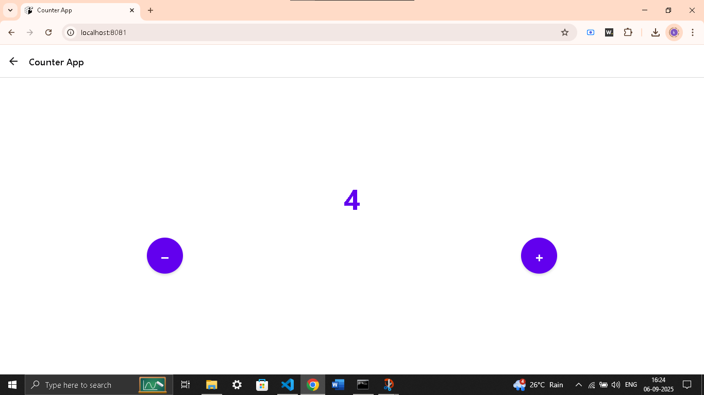

# 📱 React Native Practical Task App

A clean and simple React Native application built as part of a practical task.  
This project demonstrates **core mobile development skills**: navigation, API integration, state handling, and modern UI design.

---

## 🎯 Objective
The app is designed to showcase:
- Login screen with input validation
- Fetching and displaying posts from a public API
- Navigation across multiple screens
- State management with hooks
- A simple counter app
- Consistent styling with Flexbox

---

## ⚡ Features
✅ **Login Screen** – Enter email and password, show entered values in an alert  
✅ **Posts List** – Fetch posts from [JSONPlaceholder](https://jsonplaceholder.typicode.com/posts) and display in a scrollable list  
✅ **Post Details** – View the full post body with metadata (ID, User ID)  
✅ **Counter Screen** – Increment/Decrement counter using React Hooks  
✅ **Navigation** – Implemented with React Navigation (Stack)  
✅ **Styling** – Modern UI with headers, content area, and footer (`End of List`)  

---

## 🛠️ Tech Stack
- **React Native** (Expo)  
- **React Navigation (Stack Navigator)**  
- **Functional Components + Hooks**  
- **JavaScript (ES6+)**  
- **StyleSheet API**  

---

## 📂 Project Structure
```
ReactNativePracticalTask/
│── App.js                # Navigation setup (Stack Navigator)
│── screens/
│   ├── LoginScreen.js    # Login form
│   ├── PostListScreen.js # Fetch + list posts
│   ├── PostDetailScreen.js # Full post details
│   ├── CounterScreen.js  # Counter feature
│── styles/
│   └── styles.js         # Centralized styles
│── package.json
│── app.json
└── README.md
```

---

## 🚀 Getting Started

### Prerequisites
- Node.js v16+  
- Yarn or npm  
- Expo CLI  

### Installation
```bash
# 1. Clone repo
git clone https://github.com/your-username/react-native-practical-task.git
cd react-native-practical-task

# 2. Install dependencies
yarn install

# 3. Start project
npx expo start
```

### Run on:
- 📱 Expo Go app (Android/iOS)  
- 🌐 Web browser  

---

## 🎬 Screenshots

Here are the main screens of the app:

### 🔑 Login Screen


### 📜 Post List Screen


### 📝 Post Detail Screen


### ➕➖ Counter Screen


---


## 📹 Demo Video
A short video demonstration of the app is available here:  
👉 *(Insert your Loom/Google Drive/YouTube link)*

---

## 📌 Key Takeaways
This project shows:
- Understanding of React Native fundamentals
- API integration and state handling
- Navigation flow between multiple screens
- Clean, modular, and scalable code structure
- UI consistency using Flexbox and reusable styles

---

## ✨ Author
👤 **Kamal**  

